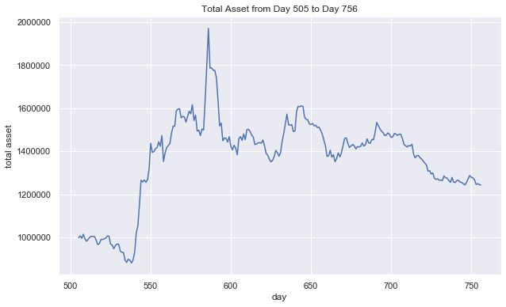

# Algorithmic_Trading
The goal of this project is to conduct algorithmic trading using supervised learning approaches. The dataset is given by Dr. Xin Tong, a professor of DSO 530 class at USC Marshall. Each table is the daily stock data of 50 companies from Day 1 to Day 756 (in the years 2017-2019), which are constituents of the SSE 50 index. The data of one day includes open, high, low, volume, and close prices.

## Summary
- I first develop a regression model to predict the prices of the 50 stocks for the next day. After exploring the dataset, I create 15 features including standard features for technical analysis of the stock market and 1-day lag variables. Then, I build a linear regression, Lasso regression, Ridge regression, random forest, and boosted tree model and run Gridsearchcv to choose the best model and hyperparameters based on the MSE. Finally, I make daily predictions of the stock prices for the simulation period from Day 505 to Day 756 with the chosen model (1. Stock_Prediction.ipynb)
- Next, I design a day trading tool using linear programming (Gurobi) and stock price forecasts from the regression model. I simulate and test the algorithm assuming that I start trading on Day 505 with $1M and monetize all the stocks by the end of Day 756. The objective of the optimization model is to maximize the cash flow the next day (2. Optimization.ipynb)

## Conclusion
- The day trading tool based on the stock price prediction model and linear programming resulted in the final return of 24%, Sharpe ratio of 0.75, and 118 days with profit during the simulation period from Day 505 to Day 756.
- We also see an acceptable shape in terms of how the trading strategy performs from the plot below. While there are periods with a decrease in the total assets, the overall trend tends to be positive.
- Further improvements to our strategy could include an exploration into an even better prediction model. For example, we could find more data to engineer useful features or integrate classification models.

